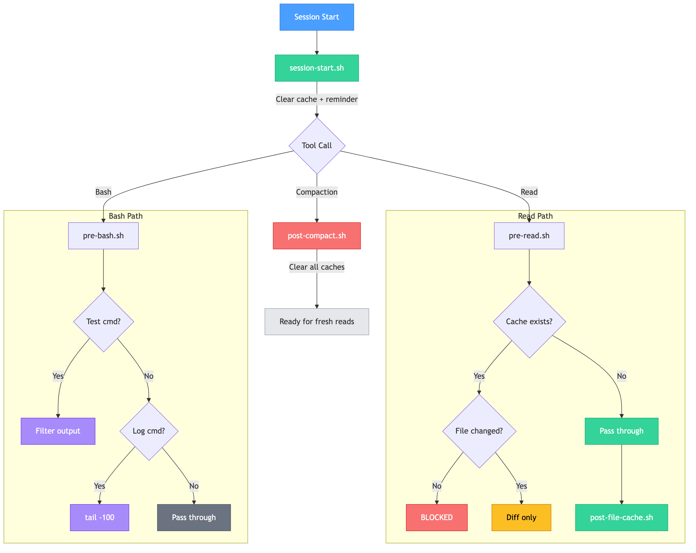
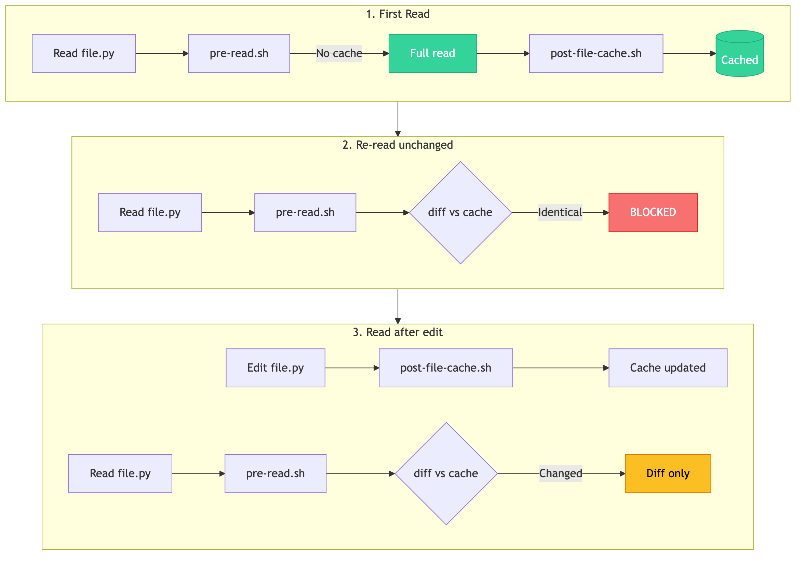
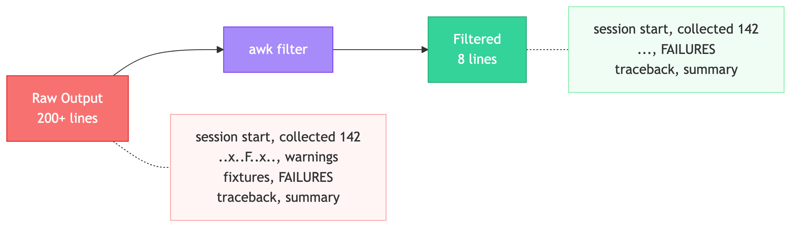
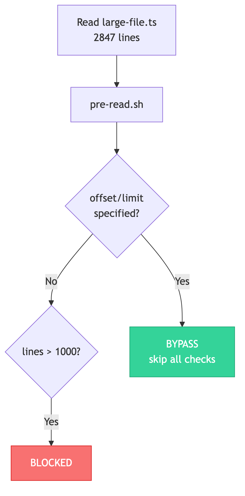

# 🐄 cache-cow

> *Your token cash cow — milk the cache, spare the tokens.*

Token-saving hooks for [Claude Code](https://docs.anthropic.com/en/docs/claude-code). Reduce unnecessary token consumption by caching file reads, filtering verbose output, and blocking wasteful re-reads.

## 🥛 The Problem

Claude Code consumes tokens every time it reads a file, runs a test, or checks logs. In a typical session:

- 📖 The same file gets read **3–5 times** (before edit, after edit, during review...)
- 🧪 Test runners dump **hundreds of lines** when only the summary matters
- 📜 Log commands output **entire files** when the last 100 lines would suffice
- 🐘 Large files (1000+ lines) get read in full when only a section is needed

**cache-cow** intercepts these patterns with Claude Code's [hook system](https://docs.anthropic.com/en/docs/claude-code/hooks) and squeezes out the waste — one cached read at a time.

## 🔧 How It Works

| Hook | Event | What it does |
|---|---|---|
| `session-start.sh` | SessionStart | Clears read cache, cleans up stale caches (>7 days) |
| `pre-read.sh` | PreToolUse (Read) | Blocks re-reads of unchanged files (diff-only for changed). Blocks files >1000 lines (full reads only). Blocks repeated partial reads (offset/limit) of already-read ranges |
| `post-file-cache.sh` | PostToolUse (Read/Edit/Write) | Caches full reads; tracks partial read ranges with merge; invalidates ranges on Edit/Write |
| `pre-bash.sh` | PreToolUse (Bash) | Filters test output to essentials (start, failures, summary). Limits log commands to `tail -100` |
| `pre-bash.helper.filter.sh` | (helper) | awk filter for pytest, jest, Django test, vitest output |
| `post-compact.sh` | PostCompact | Clears all caches after context compaction |

> For detailed per-hook documentation (problem, solution, result), see **[docs/HOOKS.md](docs/HOOKS.md)**.

### Session Lifecycle

<p align="center">
  
</p>

### Read Cache Flow

<p align="center">
  
</p>

### Test Output Filter

<p align="center">
  
</p>

### Large File Protection

<p align="center">
  
</p>

## 📦 Prerequisites

Before installing, make sure you have the following:

| Dependency | Required | Used by | Install |
|---|---|---|---|
| **[Claude Code](https://docs.anthropic.com/en/docs/claude-code)** | Yes | All hooks | [Install guide](https://docs.anthropic.com/en/docs/claude-code/getting-started) |
| **[jq](https://jqlang.github.io/jq/)** | Yes | All hooks (JSON parsing) | `brew install jq` (macOS) / `apt install jq` (Linux) |
| **bash** 4.0+ | Yes | All hooks | Pre-installed on macOS/Linux |
| **python3** | No | Fallback for `pre-read.sh`, `post-file-cache.sh` when jq is unavailable | Pre-installed on most systems |

> **Note:** `session-start.sh`, `pre-bash.sh`, and `post-compact.sh` require jq with no fallback. The installer will check for jq and exit if it's not found.

### Verify Prerequisites

```bash
# Check jq
jq --version
# Expected: jq-1.7.1 (or similar)

# Check Claude Code
claude --version
# Expected: 1.x.x (or similar)
```

## 🚀 Installation

### Quick Install

```bash
git clone https://github.com/soonswan-study/cache-cow.git
cd cache-cow
bash install.sh
```

The installer will:
1. Check that `jq` is installed (exits with error if not found)
2. Symlink all hooks to `~/.claude/hooks/`
3. Merge hook configuration into `~/.claude/settings.json` (preserves existing settings)
4. Append token efficiency principles to `~/.claude/CLAUDE.md`

### Manual Install

1. Copy hooks to `~/.claude/hooks/`:
   ```bash
   mkdir -p ~/.claude/hooks
   cp hooks/*.sh ~/.claude/hooks/
   chmod +x ~/.claude/hooks/*.sh
   ```

2. Add hook config to `~/.claude/settings.json` (see [examples/settings.example.json](examples/settings.example.json))

3. (Optional) Append `examples/CLAUDE.md.example` to `~/.claude/CLAUDE.md`

## ✅ Verify Installation

```bash
# Monitor hook activity in real-time
tail -f /tmp/claude-hooks.log

# Start a new Claude Code session and check for:
# [HH:MM:SS] session-start: done
# [HH:MM:SS] post-file-cache: cached (filename.py)
# [HH:MM:SS] pre-read: cache hit, blocked re-read (filename.py)
```

## 🔄 Updating

Since the installer uses symlinks, just pull the latest:

```bash
cd cache-cow
git pull
```

Hooks are updated immediately for new sessions.

## ⚙️ Configuration

### Large File Threshold

The default threshold for blocking large file reads is **1000 lines**. This only applies to **full reads** (no `offset`/`limit`). Partial reads with `offset`/`limit` are always allowed regardless of file size. To change it, edit `hooks/pre-read.sh`:

```bash
# Change 1000 to your preferred threshold
if [[ "$LINE_COUNT" -gt 1000 ]]; then
```

### Log Tail Limit

The default limit for log output is **100 lines**. To change it, edit `hooks/pre-bash.sh`:

```bash
LIMITED="$COMMAND | tail -100"  # Change 100 to your preferred limit
```

### Skipped File Types

Binary and generated files are skipped by default. To modify, edit the `case` statement in `hooks/pre-read.sh` and `hooks/post-file-cache.sh`:

```bash
case "$FILE_PATH" in
  *.png|*.jpg|*.jpeg|*.gif|*.svg|*.ico|*.pdf|*.lock|*.min.js|*.min.css|*.map) exit 0 ;;
esac
```

## 🗂️ Project Structure

```
cache-cow/
├── hooks/                              <- Hook scripts (installed to ~/.claude/hooks/)
│   ├── session-start.sh                   Session cache init + stale cleanup
│   ├── pre-read.sh                        Read cache / diff-only / large file block
│   ├── post-file-cache.sh                 Cache after Read, update after Edit/Write
│   ├── pre-bash.sh                        Test output filter + log tail limit
│   ├── pre-bash.helper.filter.sh          awk filter for pytest/jest/vitest
│   └── post-compact.sh                    Clear caches after compaction
├── docs/                               <- Documentation
│   ├── HOOKS.md                           Detailed per-hook docs (problem/solution/result)
│   ├── diagrams/                          Mermaid source files (.mmd)
│   └── images/                            Rendered SVG diagrams
├── examples/                           <- Example configurations
│   ├── settings.example.json              Hook config for ~/.claude/settings.json
│   ├── CLAUDE.md.example                  Token efficiency principles for ~/.claude/CLAUDE.md
│   └── .claudeignore.example              Common .claudeignore exclusion patterns
├── install.sh                          <- One-command installer
├── LICENSE                             <- MIT License
└── README.md
```

## 🧠 How the CLAUDE.md Helps

The included [`examples/CLAUDE.md.example`](examples/CLAUDE.md.example) teaches Claude Code to:
- Not re-read files it already has in context
- Run independent tool calls in parallel
- Delegate verbose outputs to subagents
- Validate only once after all changes are complete

These behavioral guidelines complement the hooks: hooks enforce limits mechanically, while `CLAUDE.md` guides the model to avoid waste proactively.

## 📄 License

MIT

---

<sub>🐄 *cache-cow — because every token you save is a token you don't pay for.*</sub>
